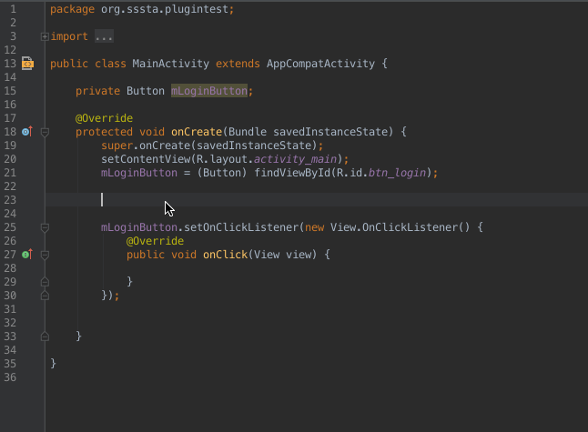
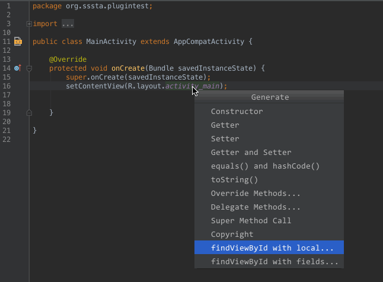
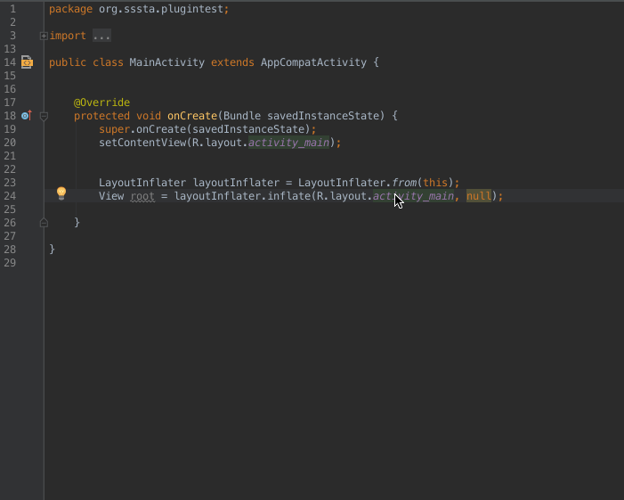

#Android Tools ( developing... )
====================
<br/>

Android Tools is an Android Studio plugin helping developer reducing heavy and repeat works in development.

<br>

####DEMO





<br/>

####**Postfix Extension**

Postfix   |Comment
----------|---------
`.toast`    |generate `Toast.makeText(this, msg,Toast.LENGTH_SHORT).show();`
...      | 


####**FindViewById Generating**
You can generate two type `findViewById` from  `setContentView(R.layout.activity_login)` statement or `layoutInflater.inflate(R.layout.activity_login,parent)` statement

*	**local** :e.g. generating `TextView usernameTextView = (TextView)findViewById(R.id.textView_username)`
*	**field** :e.g. generating `private TextView mUsernameTextView;` and<br/>
	`mUsernameTextView = (TextView)findViewById(R.id.textView_username);`  two parts

######**Naming Rule**
*	**Activity/Fragment**: `<module>_<type>` e.g. `LoginActivity`
*	**field**: `m_<function>_<type>` e.g. `mUsernameTextView`
*	**local var**: `<function>_<type>` e.g. `usernameTextView`
*	**resourse id**: `<type>_<module>_<function>` e.g. `textView_login_username`

Assuming we have an Activity named `LoginActivity` whose's layout file named `activiy_login.xml`

A TextView in `activity_layout.xml`

```xml
	<TextView
		android:id="@+id/textView_login_username"
		...
		/>
``` 

######**The process of name-converting is as follow**

1.	Remove the type prefix of view id according to tag name
	*	`textView_login_username` -> `login_username`
	*	abbreviattional prefix also works 		e.g. `tv_login_username` -> `login_username`
2.	Remove the module according to layout file (`activity_layout`) name
	*	`login_username` -> `username`
	*	abbreviattional prefix also works 		e.g. `lgn_username` -> `username`
	
3.	Append ClassName according to tag name
	*	`username` -> `usernameTextView` or `mUsernameTextView`
	
	
finally. `textView_login_username` -> `usernameTextView` or `mUsernameTextView`

Next Plan
----------
####**Generate Adapter and Model according item layout**


License
-----------
```
Copyright (c) 2015 [cauchywei@gmail.com]

Licensed under the Apache License, Version 2.0 (the "License”);
you may not use this file except in compliance with the License.
You may obtain a copy of the License at

   http://www.apache.org/licenses/LICENSE-2.0

Unless required by applicable law or agreed to in writing, software
distributed under the License is distributed on an "AS IS" BASIS,
WITHOUT WARRANTIES OR CONDITIONS OF ANY KIND, either express or implied.
See the License for the specific language governing permissions and
limitations under the License.
```